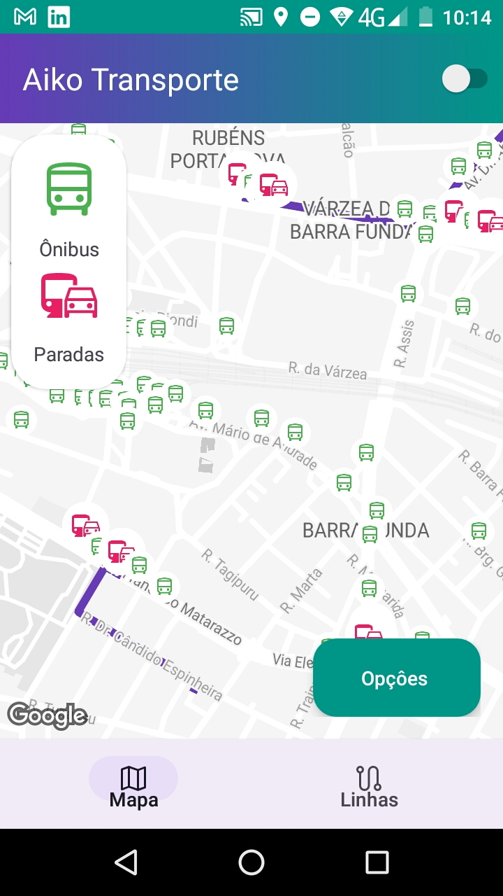
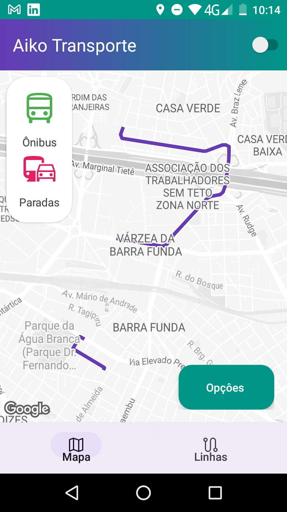
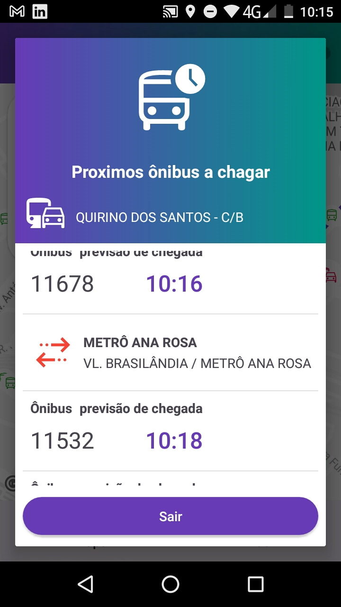
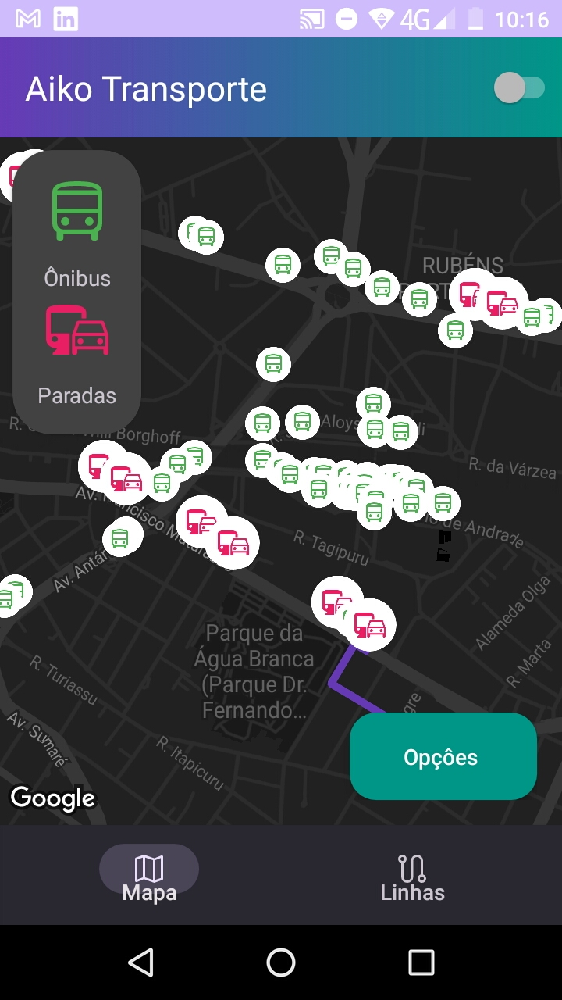

<h1><b>Aiko Transporte</b></h1>

app de visualização de paradas, linhas e onibus em tempo real 

o que esta app é capaz de fazer:

- :heavy_check_mark: <b>exibir todos os ônibus pela a cidade em tempo real num intervalo de um minuto</b>

- :heavy_check_mark: <b>exibir todas as paradas de ônibus</b>

- :heavy_check_mark: <b>exibir informações sobre linhas , paradas e ônibus<b/>

- :heavy_check_mark: <b>exibir informações sobre corredores</b>

- :heavy_check_mark:  <b>previsão de chegada de ônibus em sua respectiva parada</b>

- :heavy_check_mark: <b>calcula uma rota para uma parada mais próxima</b>

- :heavy_check_mark:  <b>sua localização no mapa</b>

- :heavy_check_mark:  <b>pesquisa de parada , linhas , ônibus</b> 

## Recursos

o intervalo de tempo de atualização é de um minuto,mostrando a movimentação dos ônibus de cidade  são paulo com símbolo de ônibus verde

todas as paradas terão um simbolo vermelho

a duas abas na app , uma para o mapa e outras para informações em geral

a previsão de chegada dos ônibus é obtida clicando na parada de ônibus

o calculo de rota pode ser feitas de duas maneiras , clicando  no botão  flutuante e depois no botão “calcular parada próxima"

minhas localização pode ser obtida por meio do segundo botão flutuante

 ## Desenvolvimento

app foi feito  com os recursos atualizados são eles

conceito de MVVM 
bibliotecas lifecycle(ViewModel , Live Data , Flow)
Coroutines (threads leves)
google maps sdk android
conceito de  injeção de dependência (DI) com lib Koin
retrofit client http
Room database
Material UI 3
Navigation Lib  

## Pastas do projeto

### <b>data</b> =  pasta de entidades que manipulam dados de serialização e deserialização

 ### <b>repository</b> = pasta  com classe de funções (singletons)

 ### <b>ui</b> = pas das classes view como fragments e dialogs

### <b>util</b> = classes de utilidades (conectividades, projeção e etc)

 #### <b>viewmodel</b> = classe de viewmodels (livecycle)

 #### <b>App.kt</b> = classe de inicialização da app , aqui é inicialização is injeções

 ### <b>modules.kt</b> = arquivo de manipulação de injeções

 ### <b>MainActivity.kt</b>  = Classe inicial

## Minhas considerações

Gostei  muito deste teste  , independente se eu passar para a próxima fase  ou não , irei implementar novos recursos nesta app de amostra, talvez com com um pouco de mais temṕo , daria para fazer uma app de mobilidade completa ,melhorias de designer ,detalhe é que perdi um pouco de tempo com problemas do servidor da spTrans com várias erro de requisição (erro 500) , mas no final , deu tudo certo e conseguir enviar o teste
