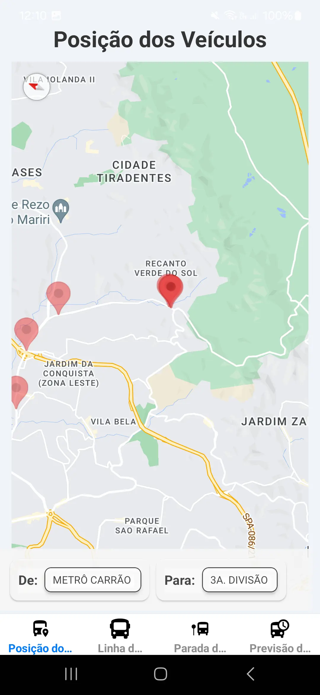
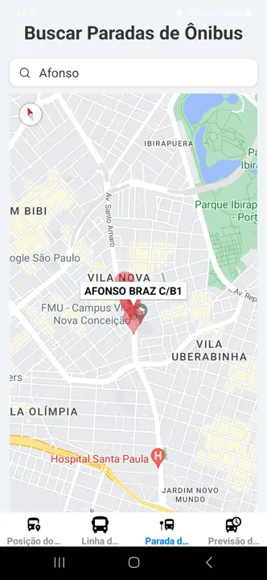
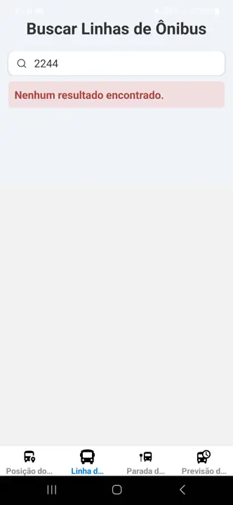

# Projeto AikoDigital

Este projeto foi desenvolvido como parte de um processo seletivo para a empresa AikoDigital.

## Requisitos

Certifique-se de ter as seguintes ferramentas instaladas:

- Java
- ADB (Android Debug Bridge)
- Android Studio
- Android SDK
- NodeJS

Execute um diagnóstico do ambiente de desenvolvimento usando ferramentas apropriadas para garantir que tudo esteja configurado corretamente.

## Instalação do Projeto

1. Clone o repositório para a sua máquina local.
2. Navegue até o diretório do projeto.
3. Execute o comando abaixo para instalar as dependências necessárias:

```bash
npm install
```

## Configuração do Ambiente

1. Crie um arquivo `.env` na raiz do projeto, seguindo o formato do arquivo `.env.example`.
2. Preencha o arquivo `.env` com os dados que podem ser obtidos ao criar uma conta gratuita no site da [SPTrans](https://www.sptrans.com.br/desenvolvedores/api-do-olho-vivo-guia-de-referencia/documentacao-api/):

```bash
API_URL=
API_TOKEN=
```

## Executando o Projeto

Para iniciar o projeto no emulador Android, utilize os comandos apropriados para sua configuração local.

```bash
npm run android
```

## Imagens do Projeto





