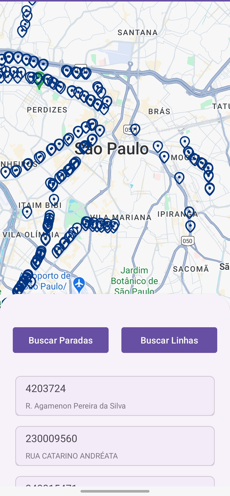
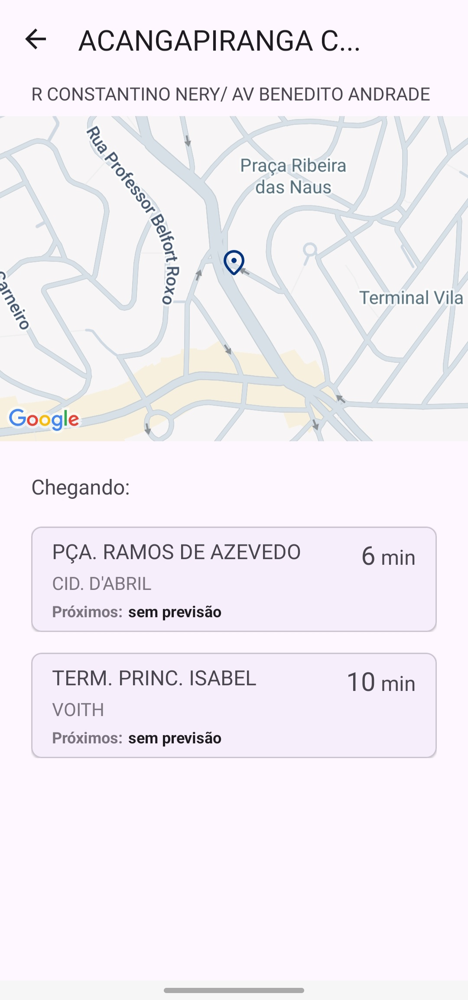
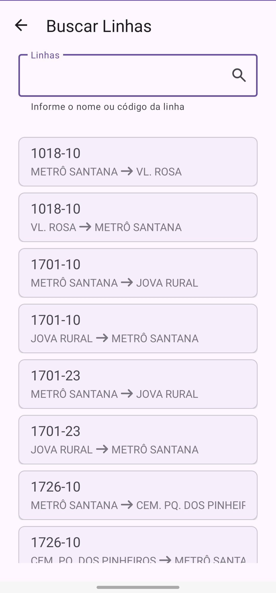

# UrbanBus

Este projeto foi desenvolvido como parte de um desafio para uma vaga de estágio em Android. O objetivo do aplicativo é fornecer informações sobre o transporte público da cidade de São Paulo, utilizando a [API Olho Vivo](https://www.sptrans.com.br/desenvolvedores/api-do-olho-vivo-guia-de-referencia/). O aplicativo permite visualizar a posição dos veículos, informações sobre as linhas, pontos de parada no mapa, previsão de chegada, além de funcionalidades de pesquisa e filtros.

## Tecnologias Utilizadas

- **Kotlin**: Linguagem principal do projeto.
- **Google Maps SDK**: Para exibição de mapas e localização dos pontos de ônibus.
- **Retrofit**: Para realizar chamadas à API Olho Vivo.
- **Hilt**: Para injeção de dependências.
- **Navigation**: Para navegação entre os fragments.
- **NavArgs**: Para passar dados entre os fragments.
- **Fragments**: Para a estrutura modular da UI.
- **Parcelize**: Para serialização de dados entre fragments.
- **Material Design**: Para a criação de elementos visuais como botões, textos, toolbar, etc.

## Funcionalidades
- **Paradas**:
  - mostra a localização de cada parada no mapa
  - permite a realização de busca com filtragem
  - possibilita ver a previsão de chegada de cada linha em uma determinada parada
- **Linhas**:
  - mostra informações sobre linhas, como temrinal de saida e chegada, etc.
  - informa a localização em tempo real dos ônibus de uma determinada linhas. 
- **Mapa Interativo**: Exibe a localização dos pontos de ônibus e veículos no mapa.
- **Pesquisa e Filtros**: Permite buscar e filtrar informações de linhas e pontos de ônibus.

## Configuração do Projeto

### Pré-requisitos

- Android Studio instalado
- Chave de API do Google Maps

### Passo a Passo

1. Clone o repositório:

   ```bash
   git clone https://github.com/eduardosdl/urban-bus-aiko.git
   ```

2. Abra o projeto no Android Studio.

3. Crie um arquivo `credentials.properties` na raiz do projeto e adicione sua chave de API do Google Maps:

   ```properties
   GOOGLE_MAPS_API_KEY=your_google_maps_api_key
   ```
   - caso prefira pode fazer uma copia do arquivo `credentials.properties.sample` e trocar o nome

5. Sincronize o projeto com o Gradle.

6. Execute o aplicativo em um emulador ou dispositivo Android.

## Estrutura do Projeto

- `app/src/main/java/com/example/urbanbus`
  - **Activity**: Contém o ponto inicial da aplicação.
  - **Fragments**: Contém os fragments para as diferentes telas do aplicativo.
  - **ViewModels**: Contém os ViewModels para gerenciamento do estado da UI.
  - **Repositories**: Contém os repositórios para acesso aos dados.
  - **Models**: Contém as classes de dados.
  - **DTOs**: Contém as classes para recebimentos dos dados.
  - **Adapters**: Contém os adapters para RecyclerViews.
  - **Network**: Contém as definições de Retrofit e APIs.
  - **DI**: Contém os módulos de injeção de dependências Hilt.

## Screenshots do aplicativo 
<p align="center">
  
  
  
</p>
