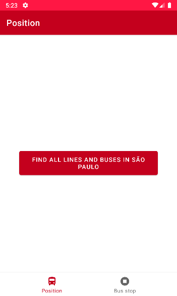
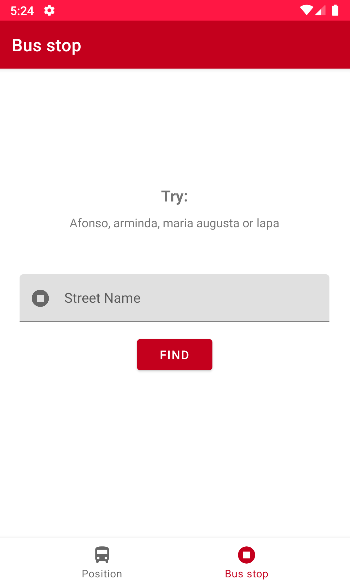
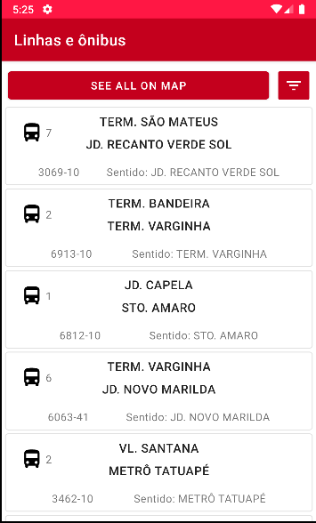
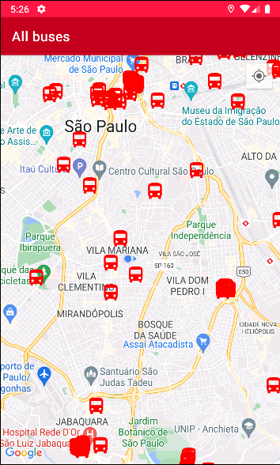
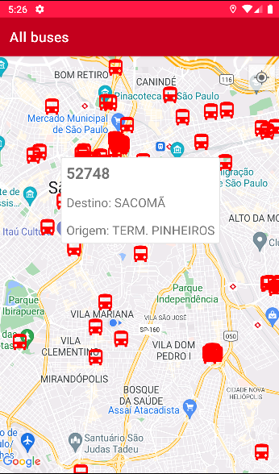
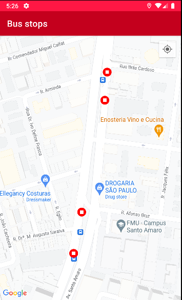
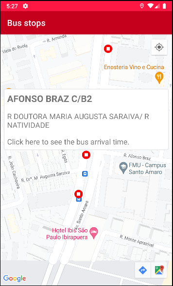
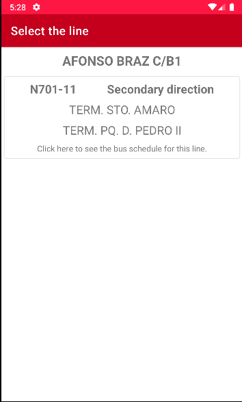
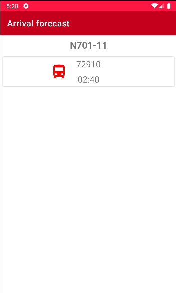

# Teste Android


Esse é o meu projeto desenvolvido para o desafio da Aiko!

## O Desafio

O objetivo era criar um app que exibisse os dados do transporte público de São Paulo,
consultando a [API **Olho Vivo**](api.md) que provê informações em tempo real do 
monitoramento da frota de ônibus da cidade de São Paulo.

## Requisitos

Esses requisitos são obrigatórios e devem ser desenvolvidos para a entrega do teste

* **Posições dos veículos**: Exibir no mapa onde os veículos estavam na sua última atualização.

* **Linhas**: Exibir informações sobre as linhas de ônibus.

* **Paradas**: Exibir os pontos de parada da cidade no mapa.

* **Previsão de chegada**: Dado uma parada informar a previsão de chegada de cada veículo que passe pela parada selecionada.

* **Pesquisa e Filtros**: Permitir que o usuário pesquise e filtre esses dados, interagindo com a interface.

# Projeto

No projeto que desenvolvi é possível: 

  

Escolher entre ver as linhas de São Paulo e os ônibus circulando no momento ou procurar pontos de ônibus usando o nome de ruas de SP.

    

Se você escolher ver os ônibus, você verá uma lista de linhas com a origem e destino e a quantidade de ônibus circulando naquela linha. Então você tem a opção de filtrar as linhas e/ou abrir a lista atual de ônibus no mapa. Infelizmente não consegui implementar o filtro a tempo. Ao clicar em cada marcador de ônibus é possível ver as informações individuais de cada ônibus. Sentido e número.

       

Voltando para a tela das paradas de ônibus, é possível pesquisar os pontos mais próximos das ruas que você irá inserir. Os pontos serão exibidos no mapa, é possível clicar em cada ponto para ver as informações individuais de cada um e ao clicar nas informações você é levado para uma lista de ônibus que passam ali.

É possível escolher um ônibus para ver uma estimativa do horário de chegada.

## Configuração ⚙️

Para usar o aplicativo é necessário que você crie um arquivo chamado: **local.properties**
Nele você precisará inserir **duas chaves**, uma do google maps e uma que você recebe ao se cadastrar na  **API Olho Vivo**

Coloque as chaves da seguinte forma:

```
MAPS_API_KEY=Sua chave do google maps entra aqui
OLHO_VIVO_API_KEY=Sua chave da API olho vivo entra aqui
```

## Conclusão

Realizei a maioria dos itens obrigatórios como: 

- [x] **Posições dos veículos**: No projeto é possível ver a localização de todos os veículos circulando em São Paulo.

- [x] **Linhas**: No projeto é possível ver todas as linhas que estão circulando em São Paulo.

- [x] **Paradas**:  No projeto é possível ver os pontos de ônibus próximos da rua inserida.

- [x]  **Previsão de chegada**: No projeto ao selecionar o ponto de ônibus é possível ver todos os ônibus que vão passar ali e o horário estimado de chegada.

- [ ] **Pesquisa e Filtros**: Infelizmente não consegui concluir essa etapa a tempo.

Gostei muito de ter participado desse teste, porque é interessante colocar em prática em um projeto real o que tenho estudado. Vou continuar implementando funcionalidades nesse projeto porque achei muito interessante até mesmo para portfolio. 

 Agradeço de verdade a oportunidade de ter participado, foi muito divertido e aguardo ansiosamente a resposta de vocês! 
 
 


