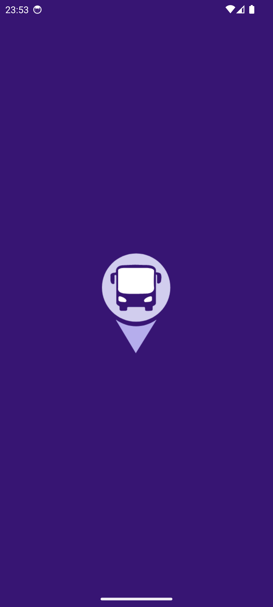

# BusConnect

## Descrição
Este projeto é uma implementação do teste disponível no repositório: [Teste Android Estágio v1](https://github.com/aikodigital/teste-android-estagio-v1). 

O BusConnect é um aplicativo Android que utiliza a SP Trans Olho Vivo API para fornecer informações de transporte público em tempo real.

## Configuração do Projeto
Para configurar o projeto corretamente, siga os passos abaixo:

1. Clone este repositório:
   ```sh
   git clone https://github.com/jefisu/teste-android-estagio-v1.git
   git checkout teste/jeferson-coutinho
   ```
2. Abra o projeto no [Android Studio](https://developer.android.com/studio?gad_source=1&gclid=EAIaIQobChMIvpKzn_iKhwMVXhOtBh2GbwSvEAAYASAAEgJc-_D_BwE&gclsrc=aw.ds&hl=pt-br):

3. Inclua as chaves das APIs no arquivo `local.properties`, localizado na raiz do projeto. Adicione as seguintes linhas, substituindo `SUA_CHAVE` pelas suas respectivas chaves de API:
   ```properties
   GM_API_KEY=SUA_CHAVE
   API_KEY=SUA_CHAVE
   ```

## Tecnologias Utilizadas
- Kotlin
- Kotlin Coroutines
- Jetpack Compose
- WorkManager
- Retrofit
- Google Maps API
- SPTrans Olho Vivo API

## Funcionalidades
- Exibição da localização dos onibus com integração do Google Maps;
- Exibição dos pontos de paradas por Linha de Onibus;
- Exibir previsão de chegada das linhas para um ponto selecionado;
- Consulta de informações de transporte público em tempo real;

## Preview das Telas

<div style="display: flex; justify-content: space-between;">
 
 
  
</div>
<div style="display: flex; justify-content: space-between;">
 
   
    
</div>
<div style="display: flex; justify-content: space-between;">
  
  </div>
