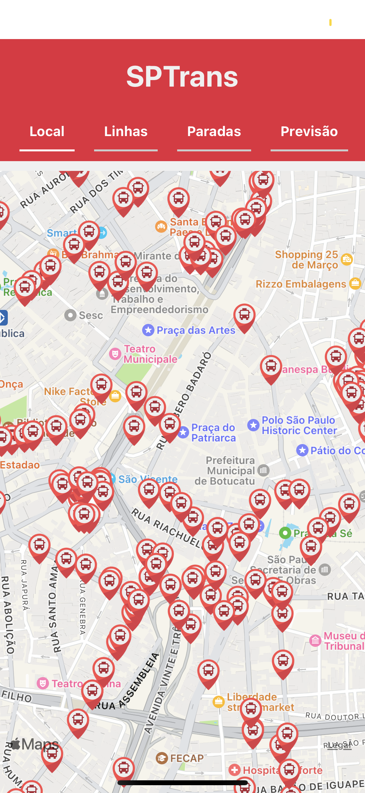
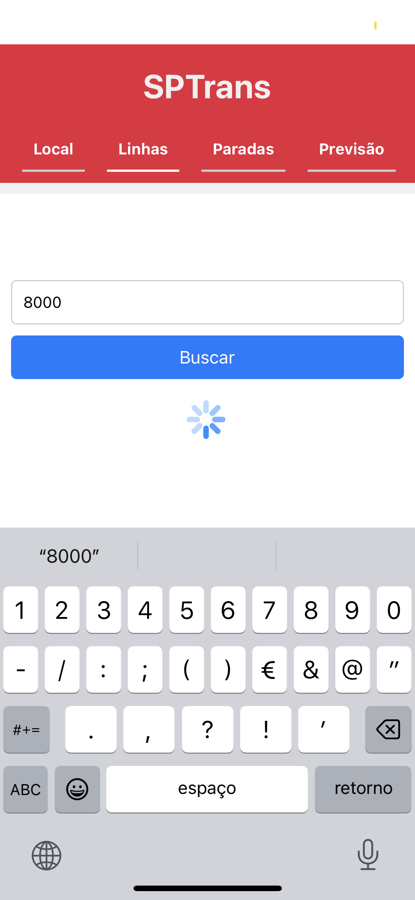
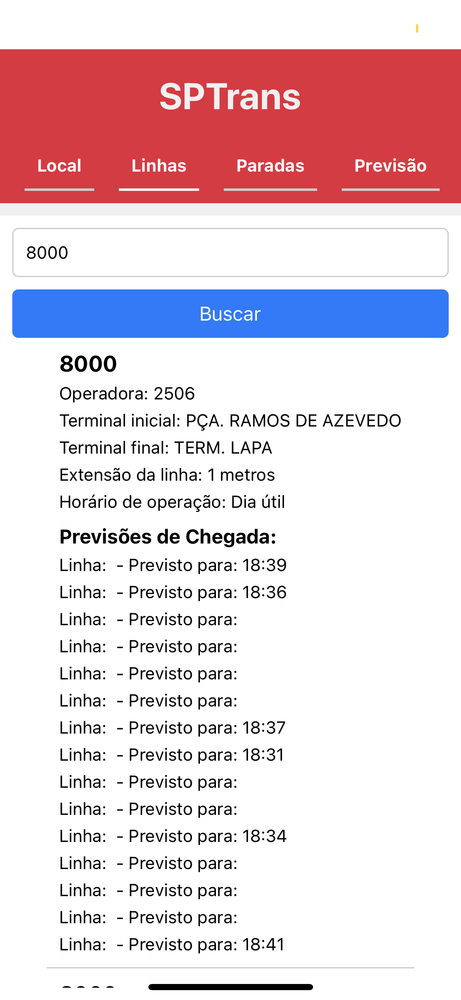
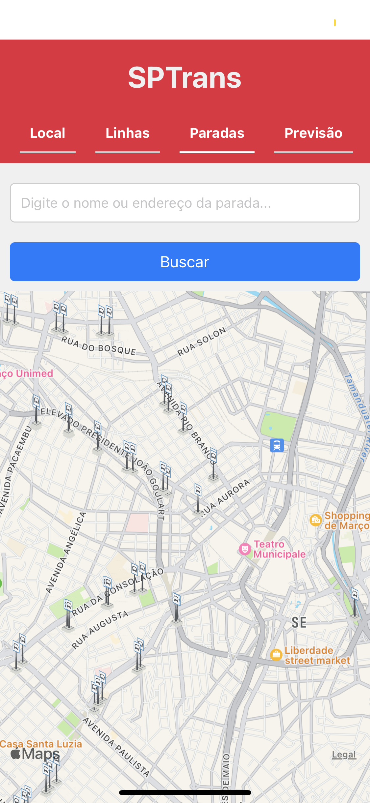
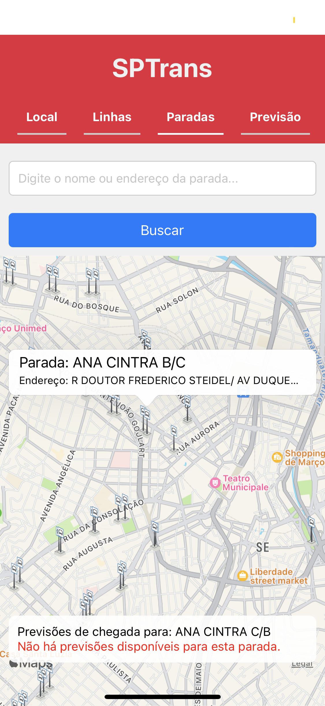

# SPTrans Mobile App

## Descrição do Projeto

O **SPTrans Mobile App** é uma aplicação móvel desenvolvida em React Native que fornece informações em tempo real sobre o transporte público de São Paulo. Através desta aplicação, os usuários podem:

- Visualizar a posição dos ônibus em tempo real.
- Procurar por paradas de ônibus próximas e obter suas localizações.
- Verificar as previsões de chegada dos ônibus nas paradas selecionadas.
- Pesquisar por paradas de ônibus utilizando nomes ou endereços.
- Navegar por diferentes abas para acessar informações locais, linhas de ônibus, paradas e previsões de chegada.

    

## Funcionalidades

1. **Mapa Interativo**:
   - Mostra a posição atual dos ônibus e paradas de ônibus no mapa.
   - Ícones de ônibus e paradas de ônibus personalizados para fácil identificação.

2. **Previsões de Chegada**:
   - Exibe previsões de chegada para os ônibus em paradas selecionadas.
   - Atualiza automaticamente as previsões quando uma parada é selecionada.

3. **Pesquisa de Paradas**:
   - Permite a pesquisa de paradas de ônibus pelo nome ou endereço.
   - Atualiza o mapa com as paradas encontradas na pesquisa.

4. **Navegação por Abas**:
   - "Local": Mostra o mapa com a posição dos ônibus.
   - "Linhas": Exibe informações sobre as linhas de ônibus disponíveis.
   - "Paradas": Permite a pesquisa e visualização de paradas de ônibus.
   - "Previsão": Mostra as previsões de chegada dos ônibus para uma parada selecionada.

## Estrutura do Projeto

- **src/**: Diretório principal do código-fonte.
  - **api/**: Contém as funções para interagir com a API da SPTrans.
  - **assets/**: Contém ícones e imagens utilizados na aplicação.
  - **screens/**: Contém as telas da aplicação, como a tela de linhas de ônibus (LinesScreen).

- **App.js**: Arquivo principal da aplicação, onde a lógica principal e a navegação entre as abas estão implementadas.

## Dependências

- **react**: Biblioteca principal para construir a interface do usuário.
- **react-native**: Framework para desenvolvimento de aplicações móveis.
- **react-native-maps**: Biblioteca para integração com mapas no React Native.

## Instalação

Siga os passos abaixo para configurar o projeto localmente:

1. Clone o repositório:
   ```bash
   git clone https://github.com/seu-usuario/sptrans-mobile-app.git
   cd sptrans-mobile-app
   ```

2. Instale as dependências do projeto:
   ```bash
   npm install
   ```

3. Inicie a aplicação:
   ```bash
   npx react-native run-android # Para Android
   npx react-native run-ios # Para iOS
   ```

## Configuração do Token da API

A aplicação utiliza um token de autenticação para interagir com a API da SPTrans. O token é definido diretamente no arquivo `App.js`:

```javascript
const token = "SEU_TOKEN_AQUI";
```

Certifique-se de substituir `"SEU_TOKEN_AQUI"` pelo seu token de autenticação válido.

## Estilo

A aplicação utiliza o `StyleSheet` do React Native para estilização dos componentes. Os estilos são definidos no final do arquivo `App.js`:

```javascript
const styles = StyleSheet.create({
  container: {
    flex: 1,
    marginTop: Platform.OS === "ios" ? 40 : 0,
    backgroundColor: "#f0f0f0",
  },
  // Outros estilos...
});
```

## Contribuição

Contribuições são bem-vindas! Sinta-se à vontade para abrir issues e pull requests. Para contribuir:

1. Fork o repositório.
2. Crie uma branch para sua feature: `git checkout -b minha-feature`.
3. Commit suas alterações: `git commit -m 'Adiciona minha feature'`.
4. Push para a branch: `git push origin minha-feature`.
5. Abra um pull request.

## Licença

Este projeto está licenciado sob a Licença MIT. Veja o arquivo [LICENSE](LICENSE) para mais detalhes.

## Contato

Para mais informações, entre em contato com:
- Seu Nome: Matheus Chiemndes [chimendes2013@outlook.com](chimendes2013@outlook.com)

Agradecemos por utilizar o **SPTrans Mobile App**!