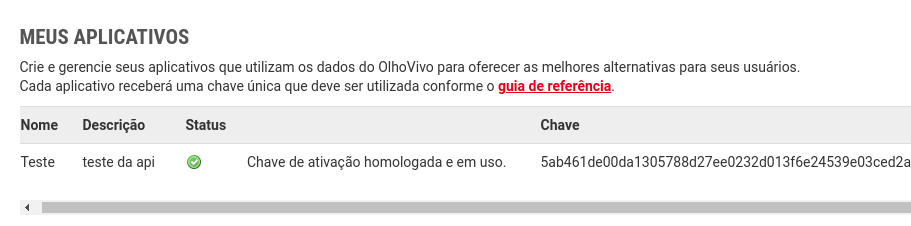
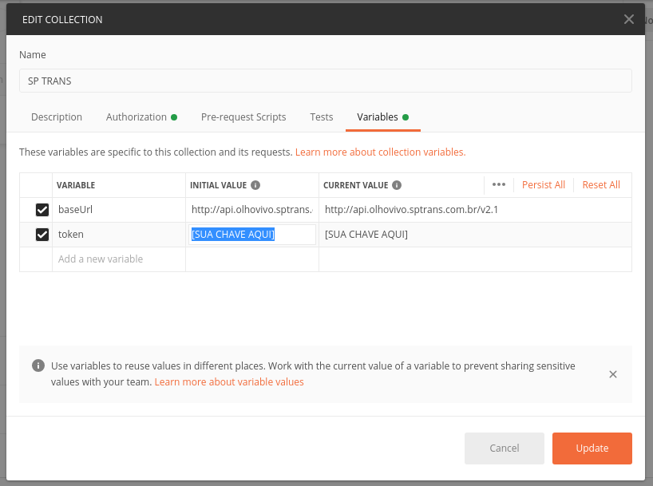

# API - Olho vivo

A API do Olho Vivo provê informações em tempo real do monitoramento da frota de ônibus da cidade de São Paulo.

## Acesso

Para ter acesso a API siga as instruções no [Guia de referência](http://www.sptrans.com.br/desenvolvedores/api-do-olho-vivo-guia-de-referencia/)

Após a criação da chave, pode ser necessário aguardar algumas horas para que o uso da API seja permitido.

## Proxy AIKO

Se estiver tendo problema com **CORS** você pode utilizar o proxy da API fornecido pela AIKO:

```HTML
https://aiko-olhovivo-proxy.aikodigital.io/
```

## Documentação

Para saber mais sobre os dados e métodos da API consulte a [Documentação](http://www.sptrans.com.br/desenvolvedores/api-do-olho-vivo-guia-de-referencia/documentacao-api/)

## Projeto Postman

Para entender mais e usar a API você pode utilizar o [projeto do postman](anexos/SP%20TRANS.postman_collection.json) disponível na pasta **anexos** neste repositório

### Acesso básico

* Entre na sessão de desenvolvedor [Meus Aplicativos](http://www.sptrans.com.br/desenvolvedores/perfil-desenvolvedor/meus-aplicativos/) e adicione um novo aplicativo
* Copie a "Chave" do aplicativo desejado



* Cole a "Chave" na variável do projeto `token`



* Envie a requisição `POST` chamada de `Autenticação` no projeto, se for retornado `true` o acesso a API foi concedido para chave inserida e já é possível enviar as outras requisições.
